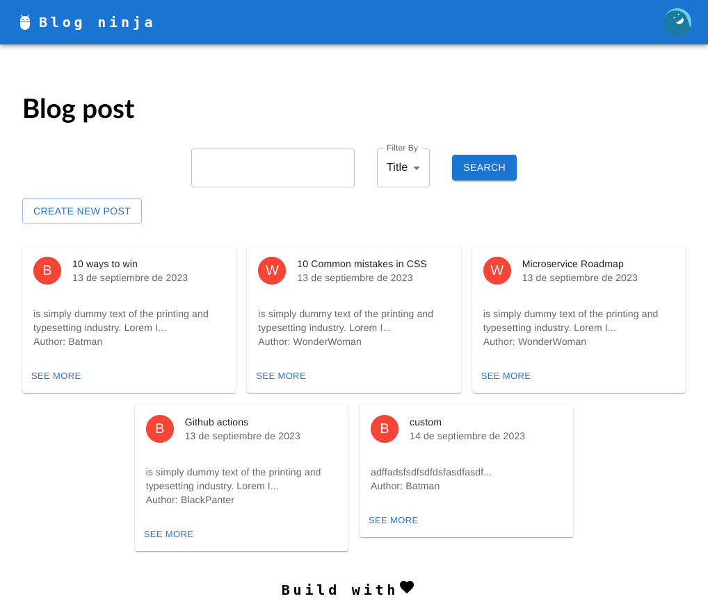
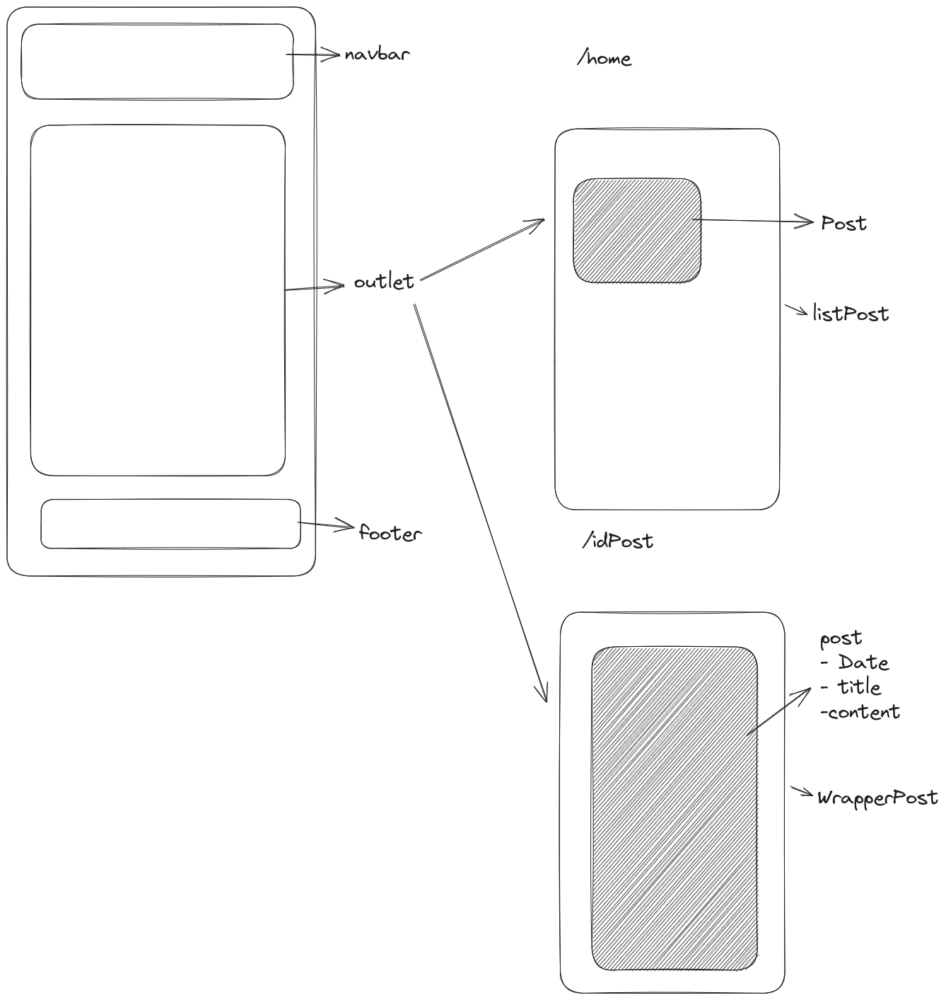

# Blog post

author : Erika F.

status : done

last update: 14- sep- 2023

<hr/>

This project is mobile browser friendly was created with react.


## Docs
|  Landing             |  Components  |
| :-------------------------:|:-------------------------:|
  |  


## System Requirements

- [git](git) v2.13 or greater
- [NodeJS](node) `>=18`
- [npm](npm) v8.16.0 or greater

To verify things are set up properly, you can run this:

```shell
git --version
node --version
npm --version
```

If you have trouble with any of these, learn more about the PATH environment
variable and how to fix it here for [windows][win-path] or
[mac/linux][mac-path].

# Branch

- main : The deploy branch
- develop : The develop branch
- feat-your-feature : To develop new features

# Demo

Hosted on [link](#)


## Setup

> If you want to commit and push your work as you go,
> first clone this repo.


After you've made sure to have the correct things (and versions) installed, you
should be able to just run a few commands to get set up:

```
git clone git@github.com:<YourUsername>/blogFront.git
cd blogFront
npm run install
```
### Prepare environment variables

For sensitive information, which we don't want them checked into git, we inject these configurations to the application as environment variables (even for local environment). 

There's a script that will help you set up the correct environment variables.

1. Copy `.env-example` file and rename into `.env` file. The file `.env` is included in `.gitignore` so the sensitive will not be checked in.

   ```bash
   $ cp .env-example .env
   ```

2. Get the actual values and paste them in `.env`.
   (ask for this file if it's your first time setting this up)

   The `env` file is not a shell execution script, but a shell configuration file. Running the command `source` loads into your **current shell session** with the appropriate environment variables instead of forking another shell session. Once you have this set, launch your IDE or text editor from the shell where the environment variables are set.


Running the app
----------------

To get the app up and running (and really see if it worked), run:

```shell
npm run dev
```

This may take a few minutes.

Build app
----------------

To generate the build app.

```
npm run build
```